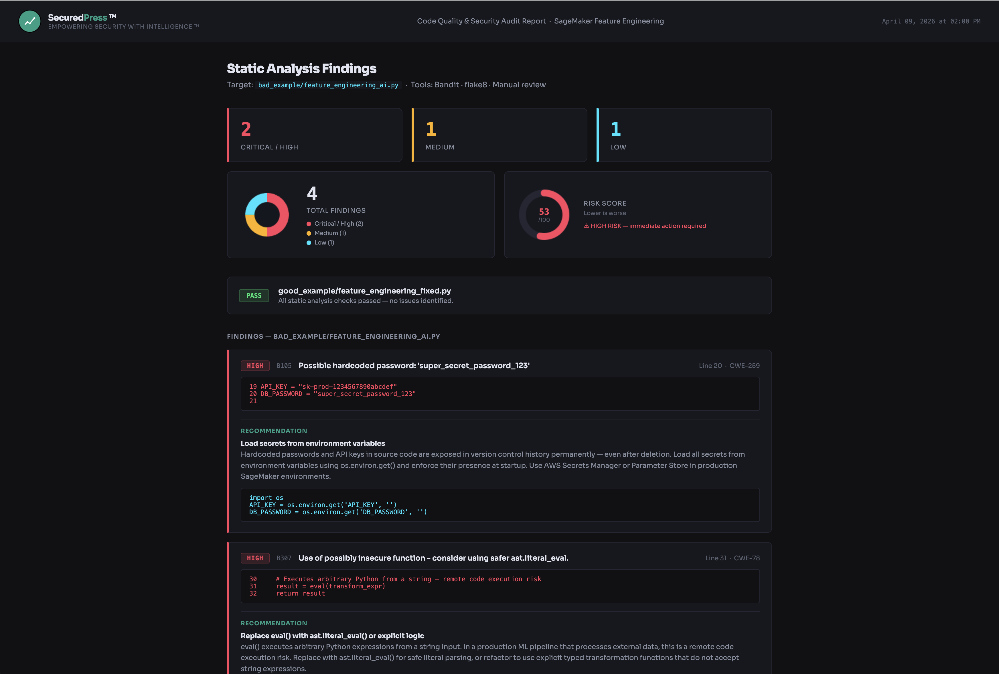

# sagemaker-code-quality-demo

A demonstration of automated code quality and security scanning for SageMaker
ML pipelines — showing how static analysis tools catch real vulnerabilities in
AI-generated Python code before they reach production.

> ⚠️ **The `bad_example/` directory contains intentional security vulnerabilities
> for demonstration purposes. Never use this code in production.**

---

## What this repo demonstrates

- Catching a **CRITICAL remote code execution vulnerability** (`eval()`) with Bandit
- Detecting a **HIGH hardcoded secret** with Bandit
- Surfacing **silent DataFrame mutation bugs** that produce wrong results with no error
- Enforcing **type annotations** with mypy strict mode
- Running **5 quality tools** as pre-commit hooks and 4 parallel CI jobs on GitHub Actions

---

## The findings

| Issue | File | Tool | Severity |
|---|---|---|---|
| `eval()` — remote code execution risk | `bad_example/` | Bandit B307 | CRITICAL |
| Hardcoded API key and password | `bad_example/` | Bandit B105/B106 | HIGH |
| Silent in-place DataFrame mutation | `bad_example/` | Code review | MEDIUM |
| Missing type annotations | `bad_example/` | mypy strict | LOW |

---

## Repo structure

```
sagemaker-code-quality-demo/
├── bad_example/
│   └── feature_engineering_ai.py    # intentionally vulnerable — DO NOT use
├── good_example/
│   └── feature_engineering_fixed.py # production-ready, fully typed
├── .pre-commit-config.yaml           # 5-tool pre-commit stack
├── .flake8                           # flake8 config aligned with black
├── pyproject.toml                    # centralized config for all tools
└── .github/workflows/
    └── quality.yml                   # 4 parallel CI jobs
```

---

## Tool stack

| Tool | Purpose |
|---|---|
| `isort` | Import ordering |
| `black` | Code formatting |
| `flake8` | Style and syntax |
| `bandit` | Security vulnerability scanning |
| `mypy` | Static type checking |

---

## Dashboard Preview



---

## Prerequisites

| Requirement | Version | Notes |
|---|---|---|
| Python | 3.8+ | Check with `python3 --version` |
| pip | latest | Check with `pip3 --version` |
| Git | any | Required for pre-commit hooks |

---

## Setup

**Step 1 — Clone the repo:**

```bash
git clone https://github.com/securedpress/sagemaker-code-quality-demo.git
cd sagemaker-code-quality-demo
```

**Step 2 — Create a virtual environment (recommended):**

```bash
python3 -m venv venv
source venv/bin/activate        # Mac/Linux
# venv\Scripts\activate         # Windows
```

**Step 3 — Install all dependencies:**

```bash
pip install -r requirements.txt
```

**Step 4 — Install pre-commit hooks:**

```bash
pre-commit install
```

This installs all five quality tools as git hooks — they run automatically
on every `git commit` from this point forward.

---

## Running the demo

**Option A — Generate the HTML findings report:**

```bash
python3 scripts/generate_report.py
```

Opens `reports/findings_report.html` automatically in your browser.
Shows all findings with severity ratings, CWE references, and remediation recommendations.

**Option B — Run tools individually:**

```bash
# Scan bad_example — expect findings
bandit bad_example/feature_engineering_ai.py
flake8 bad_example/feature_engineering_ai.py
mypy bad_example/feature_engineering_ai.py --strict --ignore-missing-imports

# Scan good_example — expect clean pass
bandit good_example/feature_engineering_fixed.py
flake8 good_example/feature_engineering_fixed.py
mypy good_example/feature_engineering_fixed.py --strict --ignore-missing-imports
```

**Option C — Run all tools via pre-commit:**

```bash
pre-commit run --all-files
```

---

## CI pipeline

Four parallel GitHub Actions jobs run on every push and pull request:

```
lint      → isort + black + flake8 on good_example
security  → bandit on both examples (bad expected to fail, good must pass)
types     → mypy strict on good_example
quality   → summary gate — passes only when all three above pass
```

---

## About SecuredPress

SecuredPress builds and governs AI/ML systems — code quality, cost, security,
and compliance delivered end to end.

**Empowering Security with Intelligence ™**

[securedpress.com](https://securedpress.com)